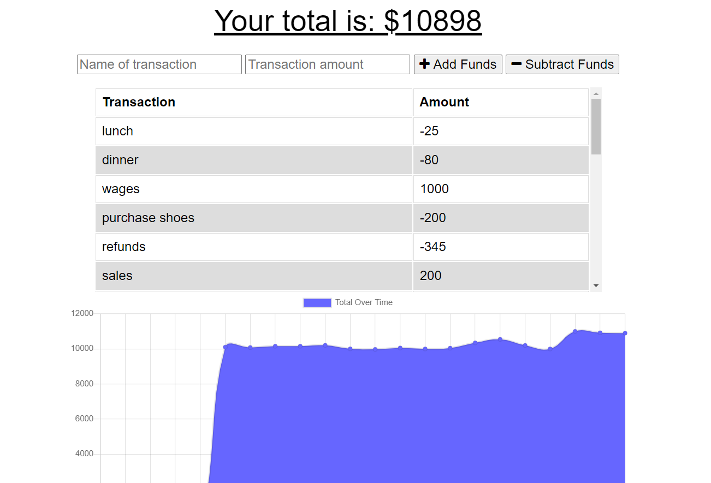

# BUDGET TRACKER 
     
## Description

The Budget Tracker allows users to track their expenses and income, whether online or offline.

## Table of Contents

* [Installation](##installation)
* [Usage](#usage)
* [License](#license)
* [Contributing](#contributing)
* [Tests](#tests)
* [Questions?](#questions)

## Installation

The application runs in the browser and uses Mongo Db to store users transaction data. User transactions that are entered offline are stored in indexedDb before being added to the database when the user is next online. 

## Usage

The user enters their transactions and these transactions are recorded and stored. Transactions can be entered either when the user is online or offline. When offline, transactions are stored locally before being added to the database when the user goes back online.

## Screenshots

## License

This application is covered under GNU GPL v3.0
    
## Contributing

Others may contribute to the application if they wish to improve its functionality. Please contact me using the details below for details on how to contribute

## Tests

The application has been tested however no formal tests have been written.
    
## Questions?

Please contact me at:

GitHub: github.com/BH-2312

Email: benhilliard23@hotmail.com